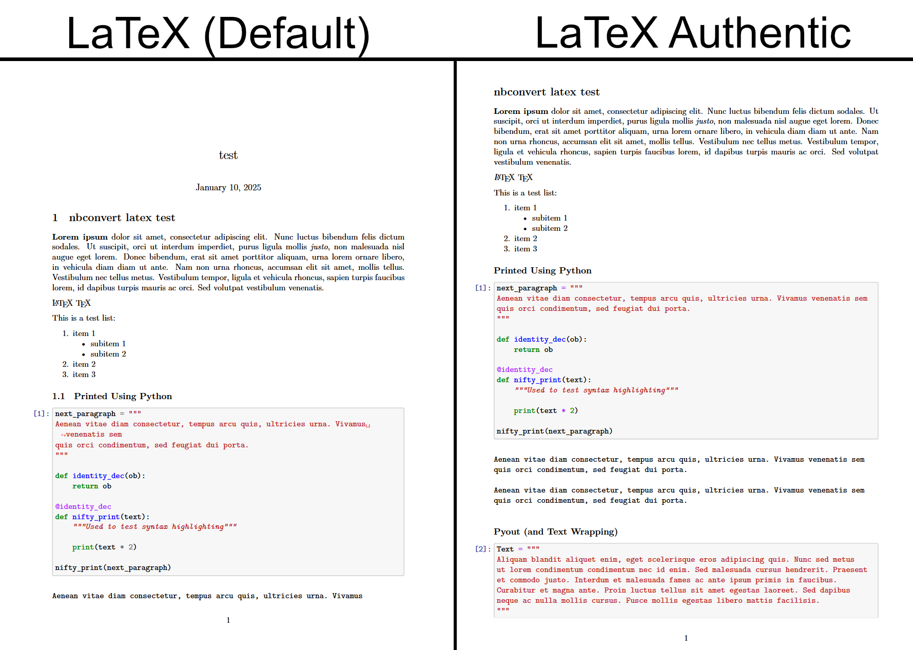

# classic.tplx
A more accurate representation of jupyter notebooks when converting to pdfs.
This template was designed to make converted jupyter notebooks look (almost) identical to the actual notebook. If something doesn't exist in the original notebook then it doesn't belong in the conversion.

This template is ready for anyone to use.

## Improvements
1. \maketitle is removed (If you want a title then add a markdown cell to the top of your notebook)
2. Sections are no longer numbered automatically (notebooks don't number sections so the pdf shouldn't)
3. **BOXES!** are drawn around code cells.
4. In/Out will move to the left as the execution count increases instead of pushing code to the right.
5. $\LaTeX$ and $\Tex$ in markdown cells will no longer cause conversion to fail
6. In/Out text colours updated to match Jupyter
7. Markdown paragraphs are no longer auto-indented in the pdf
8. Syntax highlighting improvements. (Bonus if using XeLaTeX)
9. Raw pyout text wrapping improvements.

Quick Comparison:

for a closer look see the example directory.

## Installation

### Manually:
drop all of the "*.tplx" files into the folder containing the other LaTeX nbconvert templates. If using anaconda, it should be something like: 
> */Anaconda3/Lib/site-packages/nbconvert/templates/latex

### Automatically:
Warning this has only been tested on windows. It has been reported to work on MacOS as well.
```
pip install nb_pdf_template
python -m nb_pdf_template.install
```

## Use
From the command line:
```
jupyter nbconvert --to pdf filename.ipynb --template classicm
```

Adding:
```
c.LatexExporter.template_file = 'classicm'
```
to the ```jupyter_nbconvert_config.py``` file will let you drop the "--template classicm", and to the ```jupyter_notebook_config.py``` file will let you use "download as pdf" from within the Jupyter notebook.

Replace ```classicm``` with your template of choice.

### Templates
This package offers the following templates:

Template | Use
---------|-------
classic.tplx | For most accurate recreation of the default Jupyter Notebook Style.
classicm.tplx **(Recommended)**| m for modified. Similar to classic.tplx, but in/out prompts are above cells instead of in the margin. Bonus left margins are smaller so code cells are wider.
jupyter.tplx | Deprecated. Simply redirects to classic.tplx and will be removed in the future
style_jupyter.tplx | DO NOT use this directly. Inherit from this template if you want to build your own.

## Todo
- [ ] Create a "lab.tplx" to distinguish between slight differences in the styles of the Classic notebook and Jupyter lab. (Once Jupyter lab hits release) Font, color changes. (Easy)
- [x] Add an optional to the "style_*.tplx" templates to allow them to be inherited from any template without worrying about spacing. (Easy)
- [x] Create a dual of the template that has the in/put prompts above cells instead of on the left and increase margins in that template. (Easy)
- [ ] Let the ```--no-prompt``` nbconvert flag remove prompts. (Easy, but compatibility issues with older versions of nbconvert maybe?)
- [ ] Find a solution to text wrapping in verbatim environments with commandchars. (Very Hard)
- [x] Improve syntax highlighting. (Hard)
- [x] Fix page breaks. (Moderate)

## Tips (Good for any template)
1. Want to remove page numbers? Add ```\pagenumbering{gobble}``` to a raw cell at the top of the notebook.
2. Want to set page numbers to start at a specific number? Add ```\setcounter{page}{number_here}``` to a raw cell at the top of the notebook.
3. Want to re-add the maketitle? Add:
```
\author{name}
\title{title}
\date{date}
\maketitle
```
to a raw cell at the top of the notebook to customize the maketitle.

4. Typing ```\insertword``` in a markdown cell in Jupyter Notebook can cause conversion to fail since LaTeX will attempt to compile the command. Instead use ```\\insertword``` since markdown will only render one backslash, and the conversion will use a plain text backslash.
5. If using Pandas (as pd), try:
```
pd.set_option('display.latex.repr', True)
```
at the start of your notebook. This should add nice formating of pandas dataframes in the conversion.
